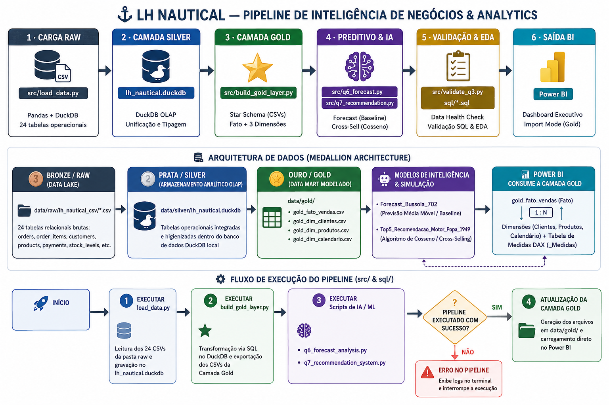
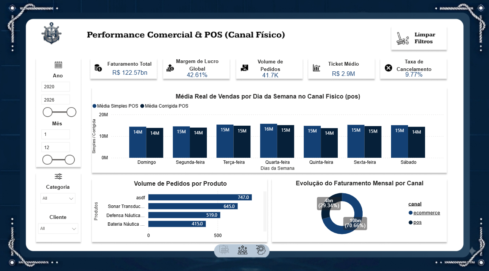
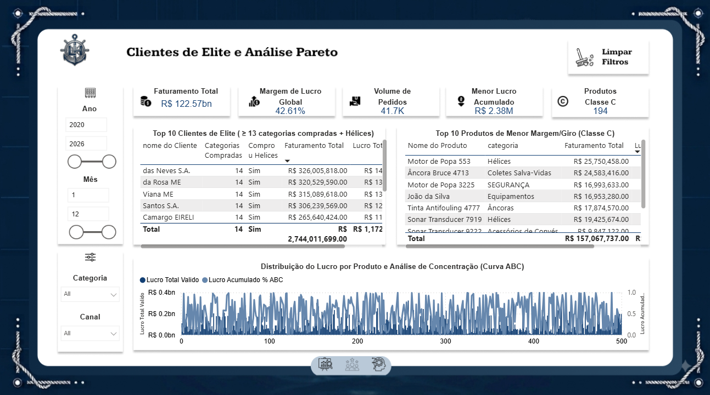
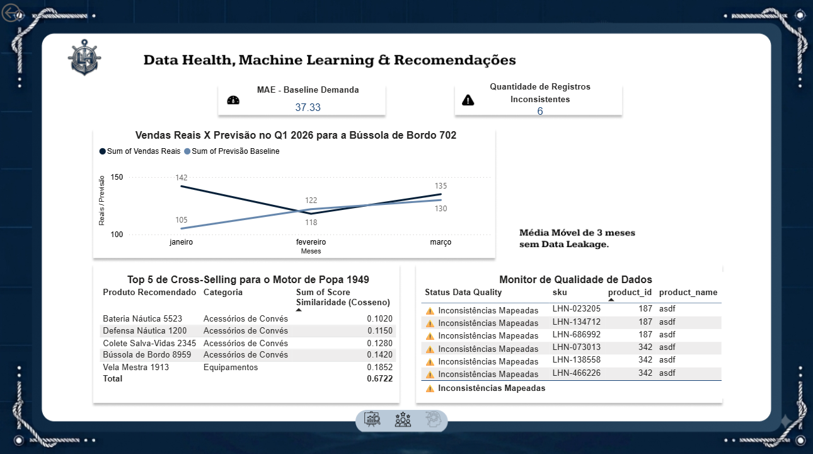
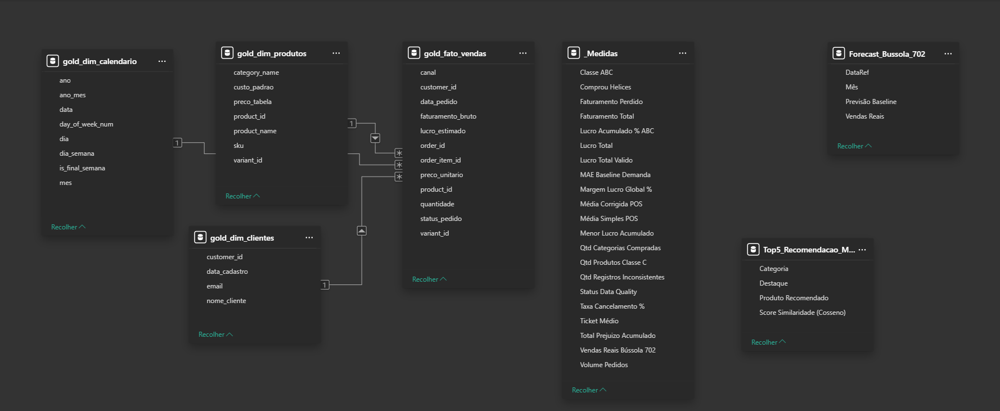
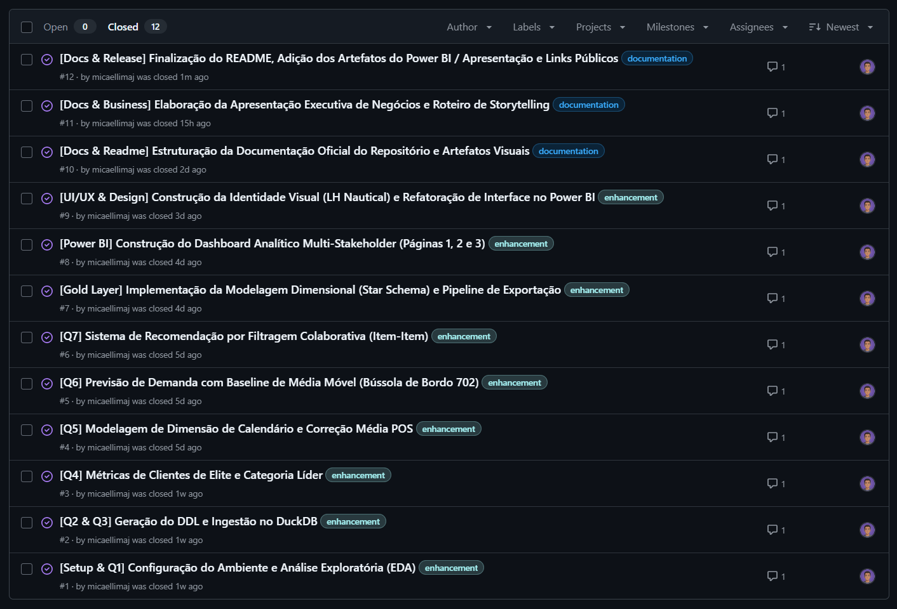

# ⚓ LH Nautical - Data Challenge & Business Intelligence Pipeline


## Introdução:

A LH Nautical é uma empresa do setor náutico que gerencia operações complexas envolvendo vendas em loja física (POS), e-commerce, catálogo diversificado de produtos e gestão de estoque. Este projeto foi desenvolvido para estruturar e consolidar a massa de dados bruta da empresa em uma arquitetura analítica moderna, limpa e performática, permitindo aos tomadores de decisão acessarem indicadores confiáveis através de um dashboard estratégico no Power BI.

## Objetivo:

* **Ingestão e Higienização**: Unificar 24 tabelas relacionais de dados brutos (raw) em um ambiente analítico de alta performance.
* **Modelagem Star Schema**: Transformar dados operacionais na camada Gold, construindo tabelas Fato e Dimensões otimizadas para Business Intelligence.
* **Resolução de Perguntas de Negócio**: Validar hipóteses operacionais, corrigir distorções em médias diárias de vendas, mapear produtos de baixo giro (Curva ABC / Classe C) e monitorar a taxa de cancelamento por canal.
* **Análise Preditiva e Inteligência**: Testar modelos de previsão de demanda e sistemas de recomendação de produtos para suporte ao checkout (cross-selling).

## Tecnologias Utilizadas:

<div align="center" style="display: inline_block">
  
  
  
  
  
  
</div>

## Diagrama (Roadmap do Projeto):



## Etapas de Desenvolvimento:


A arquitetura do projeto foi dividida em três camadas analíticas (Arquitetura Medallion):

1. **Camada RAW (data/raw/lh_nautical_csv)**:
* Armazenamento dos 24 arquivos CSV brutos originais (clientes, pedidos, itens, pagamentos, estoque, produtos, fornecedores, etc.).

2. **Camada SILVER (data/silver/lh_nautical.duckdb)**:
* Carga dos arquivos CSV para um banco DuckDB unificado (load_data.py).
* Execução de scripts SQL de Análise Exploratória de Dados (EDA) e validações de qualidade dos dados (eda_analysis.py, validate_q3.py, scripts SQL em sql/).

3. **Camada GOLD (data/gold/)**:
* Execução do pipeline de modelagem dimensional (build_gold_layer.py / create_gold_layer.sql).
* Geração das tabelas em formato CSV para consumo direto no Power BI:
    * `gold_fato_vendas.csv`
    * `gold_dim_clientes.csv`
    * `gold_dim_produtos.csv`
    * `gold_dim_calendario.csv`

## Motivo das Decisões Técnicas:

* **Uso do DuckDB na Camada Silver**: Escolhido por ser um SGBD OLAP embarcado de altíssima performance para consultas analíticas complexas e agregadas, eliminando a necessidade de subir uma infraestrutura pesada de banco relacional local.
* **Arquitetura Star Schema na Camada Gold**: A separação em Tabela Fato (eventos de venda) e Tabelas Dimensão (atributos contextuais) otimiza o modelo tabular no Power BI, reduz a redundância de dados e melhora drasticamente o desempenho de filtros e DAX.
* **Modelagem Explícita de Dimensão Calendário (`gold_dim_calendario.csv`)**: Permite a realização de análises temporais corretas (como o cálculo da Média Corrigida no POS considerando dias sem vendas) e evita a dependência de inteligência de tempo automática.


## Interface & Dashboard Analítico (Power BI):

O relatório foi desenvolvido no Power BI aplicando conceitos avançados de **Data Storytelling e UI/UX**, com paleta de cores corporativa náutica e navegação fluida entre páginas para atender diferentes níveis executivos e operacionais.

### Capa — Centro de Comando LH Nautical
Tela de entrada e boas-vindas da aplicação, projetada para direcionar o usuário à experiência imersiva de navegação pelos dados.

<div align="center">
  
</div>

---

### Página 1 — Performance Comercial & POS (Canal Físico)
Foco em monitoramento executivo de faturamento, margem global, comportamento de vendas por dia da semana (comparativo de média simples vs. corrigida) e distribuição por canal de venda (E-commerce vs. POS).

<div align="center">
  
</div>

---

### Página 2 — Clientes de Elite & Análise Pareto (Curva ABC)
Voltada para inteligência comercial e gestão de estoque. Apresenta o ranking dos Clientes de Elite (compradores recorrentes de categorias-chave), identificação dos produtos Classe C (menor margem e giro) e a distribuição da Curva ABC de Lucro.

<div align="center">
  
</div>

---

### Página 3 — Data Health, Machine Learning & Recomendação
Visão técnica e preditiva. Integra o monitor de qualidade de dados (anomalias e cadastros inconsistentes), métricas de erro de previsão de demanda (MAE) e o motor de recomendação por Filtragem Colaborativa (*Cross-Selling*).

<div align="center">
  
</div>

## Insights Extraídos do Dashboard:

* **Faturamento e Margem Global**: Faturamento acumulado consolidado em R$ 122,57 Bilhões com margem de lucro média de 42,61%.
* **Média Simples vs. Média Corrigida no POS**: A aplicação do calendário contínuo demonstrou que a média diária simples inflava a expectativa de vendas ao desconsiderar dias fechados. A média corrigida revelou a Quarta-feira como o dia de maior volume financeiro no POS.
* **Análise do Estoque Retido (Classe C)**: Nenhum produto atua com margem negativa, porém foram mapeados 194 produtos na Classe C da Curva ABC, evidenciando capital de giro parado no armazém com oportunidade de otimização de compra.
* **Canais de Venda e Cancelamentos**: O E-commerce representa 70,66% do volume de intenção de compra, mas concentra a maior taxa do percentual global de 9,77% em cancelamentos, exigindo atenção na jornada do checkout digital.

## Relatório e Power BI (Links Externos):

<div align="center">
  <table>
    <tr>
      <td>
        <b>
          <a href="https://gamma.app/docs/Relatorio-Varejo-Nautico-jsc1l5vnl9akg0m">Relatório - Varejo Náutico (CLIQUE)  </a>
        </b>
      </td>
      <td>
        <b>
          <a href="https://app.powerbi.com/view?r=eyJrIjoiYTc0MGQ0ZWItYjk5My00ZDMzLWEwZGMtNTg4YjM1M2M2YTEyIiwidCI6IjUxZGQ3ZDM4LTYwNzctNDgzNy1hYTE0LWFlNDNmZThiM2ViMCJ9"> Painel - Power BI (CLIQUE) </a>
        </b>
      </td>
    </tr>
    <tr>
      <td>
        
      </td>
      <td>
        
      </td>
    </tr>
  </table>
</div>

## Schema do Banco e Modelo de Dados:



O modelo foi projetado no Power BI seguindo o esquema estrela (Star Schema), garantindo alto desempenho analítico, relacionamentos de 1 para N (1:N) e separação clara entre dados transacionais, dimensões, tabelas de inteligência/predição e medidas DAX.

### 1. Camada Gold (Star Schema Principal)

####  `gold_fato_vendas`

Tabela fato principal contendo os registros transacionais detalhados no nível de item de pedido.

| **Campo**           | **Tipo**        | **Descrição**                                                        |
| ------------------- | --------------- | -------------------------------------------------------------------- |
| `order_item_id`     | `VARCHAR / INT` | Chave primária do item do pedido                                     |
| `order_id`          | `VARCHAR / INT` | Chave do pedido (identificador da transação)                         |
| `customer_id`       | `VARCHAR / INT` | Chave estrangeira para a dimensão de clientes                        |
| `product_id`        | `VARCHAR / INT` | Chave estrangeira para a dimensão de produtos                        |
| `variant_id`        | `VARCHAR / INT` | Identificador da variante específica do produto                      |
| `data_pedido`       | `DATE`          | Data em que a transação foi realizada                                |
| `canal`             | `VARCHAR`       | Canal de venda (`POS` / `E-commerce`)                                |
| `quantidade`        | `INT`           | Unidades vendidas do item                                            |
| `preco_unitario`    | `DECIMAL`       | Preço de venda praticado por unidade                                 |
| `faturamento_bruto` | `DECIMAL`       | Valor total bruto gerado pelo item (`quantidade` × `preco_unitario`) |
| `lucro_estimado`    | `DECIMAL`       | Margem de lucro gerada no item                                       |
| `status_pedido`     | `VARCHAR`       | Estado do pedido (`delivered`, `shipped`, `canceled`, etc.)          |

####  `gold_dim_clientes`

Tabela dimensão com os atributos e dados cadastrais dos clientes.

| **Campo**       | **Tipo**        | **Descrição**                             |
| --------------- | --------------- | ----------------------------------------- |
| `customer_id`   | `VARCHAR / INT` | Chave primária do cliente                 |
| `nome_cliente`  | `VARCHAR`       | Nome completo do cliente ou razão social  |
| `email`         | `VARCHAR`       | Endereço de e-mail cadastrado             |
| `data_cadastro` | `DATE`          | Data de registro do cliente na plataforma |

####  `gold_dim_produtos`

Tabela dimensão de catálogo com informações detalhadas e precificação de produtos.

| **Campo**       | **Tipo**        | **Descrição**                                           |
| --------------- | --------------- | ------------------------------------------------------- |
| `product_id`    | `VARCHAR / INT` | Chave primária do produto                               |
| `variant_id`    | `VARCHAR / INT` | Identificador da variante de produto                    |
| `product_name`  | `VARCHAR`       | Nome comercial do produto náutico                       |
| `category_name` | `VARCHAR`       | Categoria do produto (ex: Hélices, Motores, Iluminação) |
| `sku`           | `VARCHAR`       | Código SKU do produto                                   |
| `preco_tabela`  | `DECIMAL`       | Preço oficial de tabela/catálogo                        |
| `custo_padrao`  | `DECIMAL`       | Custo de aquisição/produção do item                     |

####  `gold_dim_calendario`

Dimensão temporal para suporte à inteligência de tempo e análise contínua de datas.

| **Campo**         | **Tipo**        | **Descrição**                                                  |
| ----------------- | --------------- | -------------------------------------------------------------- |
| `data`            | `DATE`          | Chave primária de data (nível diário)                          |
| `ano`             | `INT`           | Ano com 4 dígitos (ex: 2025)                                   |
| `mes`             | `INT`           | Número do mês (1 a 12)                                         |
| `dia`             | `INT`           | Dia do mês                                                     |
| `ano_mes`         | `VARCHAR`       | Identificador de ano e mês (ex: 2025-05)                       |
| `dia_semana`      | `VARCHAR`       | Nome do dia da semana (ex: Segunda-feira)                      |
| `day_of_week_num` | `INT`           | Índice numérico do dia da semana (1 a 7)                       |
| `is_final_semana` | `BOOLEAN / INT` | Indicador se a data pertence ao final de semana (1=Sim, 0=Não) |

---

###  2. Tabelas de Modelos Preditivos & Simulação (Machine Learning / Analytics)

####  `Forecast_Bussola_702`

Tabela utilizada para simulação e avaliação do modelo *baseline* de previsão de demanda para o item estratégico *Bússola de Bordo 702*.

| **Campo**           | **Tipo**        | **Descrição**                                            |
| ------------------- | --------------- | -------------------------------------------------------- |
| `DataRef`           | `DATE`          | Data de referência do período analisado                  |
| `Mês`               | `VARCHAR / INT` | Mês de referência                                        |
| `Previsão Baseline` | `DECIMAL`       | Quantidade estimada pelo modelo preditivo de Média Móvel |
| `Vendas Reais`      | `INT`           | Quantidade real efetivamente vendida no período          |

####  `Top5_Recomendacao_Motor_Popa_1949`

Tabela com o resultado do algoritmo de filtragem colaborativa / similaridade para venda casada (*cross-selling*).

| **Campo**                      | **Tipo**  | **Descrição**                                               |
| ------------------------------ | --------- | ----------------------------------------------------------- |
| `Categoria`                    | `VARCHAR` | Categoria do produto recomendado                            |
| `Produto Recomendado`          | `VARCHAR` | Nome do produto sugerido para recomendação no checkout      |
| `Score Similaridade (Cosseno)` | `DECIMAL` | Grau de afinidade/similaridade matemática entre os produtos |
| `Destaque`                     | `VARCHAR` | Marcador de recomendação principal ou categoria             |

---

### 3. Tabela de Medidas DAX (`_Medidas`)

Tabela utilitária sem colunas físicas, destinada à centralização das métricas de negócio e cálculo em tempo de execução:

| **Nome da Medida**             | **Descrição de Negócio**                                                    |
| ------------------------------ | --------------------------------------------------------------------------- |
| `Faturamento Total`            | Soma total do faturamento bruto dos pedidos efetuados                       |
| `Faturamento Perdido`          | Volume financeiro associado a pedidos cancelados                            |
| `Lucro Total`                  | Soma total do lucro estimado dos produtos vendidos                          |
| `Lucro Total Valido`           | Lucro gerado considerando apenas pedidos válidos e entregues                |
| `Margem Lucro Global %`        | Percentual médio de lucro sobre o faturamento total                         |
| `Ticket Médio`                 | Valor médio gasto por pedido                                                |
| `Volume Pedidos`               | Contagem distinta do total de pedidos realizados                            |
| `Taxa Cancelamento %`          | Percentual de pedidos cancelados sobre o total de intenções                 |
| `Média Simples POS`            | Média de vendas no PDV dividida apenas pelos dias em que houve venda        |
| `Média Corrigida POS`          | Média real de vendas no PDV considerando todos os dias do calendário        |
| `Total Prejuízo Acumulado`     | Perda financeira total decorrente de cancelamentos e devoluções             |
| `Comprou Helices`              | Indicador/Flag se o cliente efetuou compra na categoria Hélices             |
| `Qtd Categorias Compradas`     | Número de categorias distintas adquiridas por um cliente específico         |
| `Classe ABC`                   | Classificação do produto no ranking de lucro acumulado (A, B ou C)          |
| `Lucro Acumulado % ABC`        | Percentual acumulado do lucro para construção da Curva ABC                  |
| `Qtd Produtos Classe C`        | Contagem total de itens classificados na Classe C da Curva ABC              |
| `Menor Lucro Acumulado`        | Menor valor acumulado encontrado na análise de margens por produto          |
| `MAE Baseline Demanda`         | Erro Médio Absoluto (*Mean Absolute Error*) do modelo preditivo de demanda  |
| `Vendas Reais Bússola 702`     | Volume total de unidades vendidas do modelo Bússola 702                     |
| `Status Data Quality`          | Indicador de integridade para monitoramento do *Data Health*                |
| `Qtd Registros Inconsistentes` | Contagem de cadastros contendo inconsistências ou dados sintéticos (`asdf`) |


## Como Executar o Projeto

### Pré-requisitos

* Python 3.10+ instalado
* Git instalado

### Passo a Passo

1. **Clonar o repositório:**

   ```bash
   git clone https://github.com/micaellimaj/lh-nautical-data-challenge
   cd lh-nautical-data-challenge
   ```

2. **Criar e ativar o ambiente virtual:**

   **Windows:**

   ```bash
   python -m venv venv
   .\venv\Scripts\activate
   ```

   **Linux/macOS:**

   ```bash
   python3 -m venv venv
   source venv/bin/activate
   ```

3. **Instalar as dependências:**

   ```bash
   pip install -r requirements.txt
   ```

4. **Carregar a Camada Raw para Silver (DuckDB):**

   ```bash
   python src/load_data.py
   ```

5. **Construir a Camada Gold (Data Mart para BI):**

   ```bash
   python src/build_gold_layer.py
   ```

   Os arquivos CSV resultantes serão gerados no diretório `data/gold/`.

6. **Abrir o Dashboard no Power BI:**

   * Abra o **Power BI Desktop**.
   * Conecte a fonte de dados aos arquivos CSV presentes na pasta `data/gold/`.
   * Utilize os arquivos da camada **Gold** para construir ou atualizar o dashboard de BI.

## Governança de Projetos & Boas Práticas de Engenharia:

Para além do desenvolvimento técnico e das análises analíticas, este repositório segue rigorosos padrões de **governança de código, versionamento e gestão de tarefas**:

###  Gestão de Demandas via GitHub Issues
O projeto foi totalmente focado em metodologias ágeis. Cada etapa do ciclo de vida dos dados (desde o setup inicial, modelagem DuckDB, análises de IA, construção de dashboards até a documentação) foi rastreada e encerrada por meio de **GitHub Issues dedicadas**.

<div align="center">
  
  <p><i>Painel de Issues concluídas com mapeamento de requisitos, entregas e resoluções registradas.</i></p>
</div>


###  Padrões de Versionamento (Git Flow & Conventional Commits)

* **Estratégia de Branching (`feature/*`):** Desenvolvimento isolado por funcionalidade através de branches temáticas (ex.: `feature/gold-layer`, `feature/analytics-forecast-recommendation`, `feature/docs-readme`), garantindo que a branch principal (`main`) permaneça sempre estável e pronta para produção.
* **Padronização de Commits:** Utilização do padrão **Conventional Commits** (`feat:`, `docs:`, `fix:`, `refactor:`) para garantir rastreabilidade clara das alterações e histórico de mudanças semântico.

## Estrutura do Repositório:

```

├── data/                             # Diretório de armazenamento de dados (Medallion Architecture)
│   ├── gold/                         # Data Mart - Camada Gold (CSV para consumo no Power BI)
│   │   ├── gold_dim_calendario.csv   # Dimensão temporal
│   │   ├── gold_dim_clientes.csv     # Dimensão de clientes
│   │   ├── gold_dim_produtos.csv     # Dimensão de produtos
│   │   └── gold_fato_vendas.csv      # Fato transacional de vendas
│   ├── raw/                          # Data Lake - Camada Raw / Bronze (Arquivos brutos)
│   │   └── lh_nautical_csv/          # 24 tabelas operacionais em formato CSV
│   └── silver/                       # Camada Silver - Banco OLAP relacional unificado
│       └── lh_nautical.duckdb        # Arquivo de banco de dados DuckDB
├── readme/                           # Recursos visuais usada na documentação do readme
├── reports/                          # Relatórios, artefatos e capturas do dashboard
├── sql/                              # Scripts SQL para EDA, validação e modelagem
│   ├── 01_eda_orders.sql             # Análise exploratória da tabela de pedidos
│   ├── 02_q3_validation.sql          # Script de validação das questões de negócio
│   ├── 03_q4_analysis.sql            # Consultas para análise do PDV e cancelamentos
│   ├── 04_q5_calendar_dimension.sql  # Criação e tratamento da dimensão calendário
│   ├── create_gold_layer.sql         # Script SQL de construção da camada Gold
│   └── schema.sql                    # Definição do esquema das tabelas
├── src/                              # Scripts em Python para pipelines e análises
│   ├── __init__.py                   # Inicializador do pacote Python
│   ├── build_gold_layer.py           # Pipeline de construção e exportação da Camada Gold
│   ├── eda_analysis.py               # Script Python para Análise Exploratória de Dados
│   ├── generate_schema.py            # Automação de extração/geração dos esquemas
│   ├── load_data.py                  # Script de carga dos CSVs brutos para o DuckDB
│   ├── q4_analysis.py                # Processamento analítico da questão 4
│   ├── q5_calendar_analysis.py       # Algoritmo de tratamento do calendário contínuo
│   ├── q6_forecast_analysis.py       # Modelo preditivo de demanda (Bússola de Bordo 702)
│   ├── q7_recommendation_system.py   # Motor de recomendação / similaridade (Cross-selling)
│   └── validate_q3.py                # Script de validação e qualidade dos dados
├── venv/                             # Ambiente virtual local Python
├── .gitignore                        # Arquivos e pastas ignorados pelo versionamento Git
├── lh_nautical.duckdb                # Instância local do banco DuckDB
├── LICENSE                           # Licença de uso do repositório
├── README.md                         # Documentação principal do projeto
└── requirements.txt                  # Lista de dependências e bibliotecas Python

```

## Conclusão

O projeto entregou uma solução completa de ponta a ponta, saindo de dados transacionais brutos desestruturados até a consolidação de um Data Mart modelado em Star Schema. A infraestrutura em Python e DuckDB garantiu eficiência de processamento e reprodutibilidade, fornecendo à diretoria da LH Nautical um ambiente de BI confiável, governado e auditável para suporte às tomadas de decisão estratégicas.

<br />
<p align="center">
  <kbd>
    <b> 🚢 Com esta estrutura, a LH Nautical consolida a inteligência de dados como leme para sua expansão no varejo náutico. Agradeço a atenção e o tempo dedicado à leitura e análise deste projeto — bons ventos e até logo! 🚢 </b>
  </kbd>
</p>